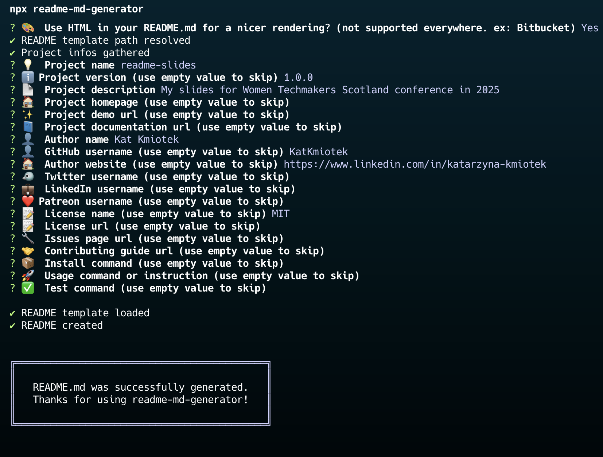

# Magical Tools - all in one CLI

Nothing better than Terminal User Interface to write documentation for me  
  
`npx readme-md-generator`
  
  
  
  
🔗 [Try yourself!](https://github.com/kefranabg/readme-md-generator)

