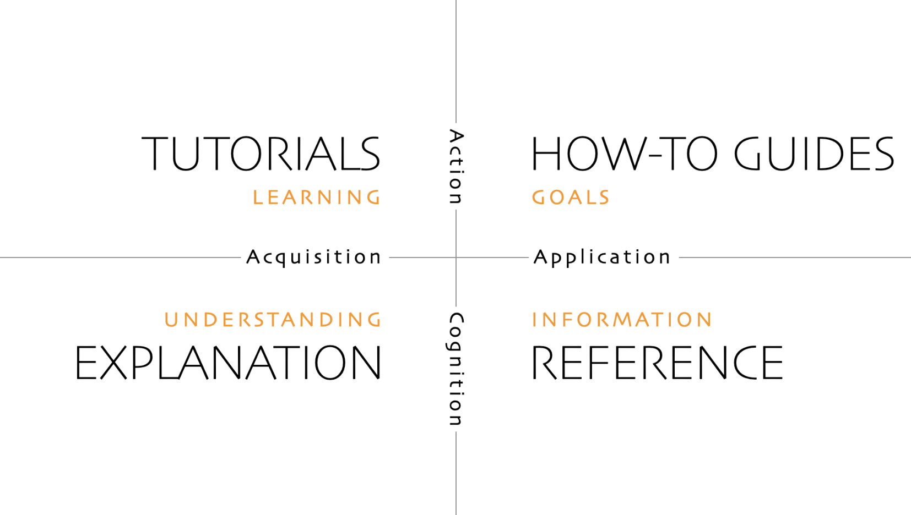

# Diátaxis Framework

Four quadrants approach: 
 - **tutorials**
 - **how-to guides**
 - **explanations**
 - **reference**

🔗 [https://diataxis.fr/](https://diataxis.fr/)

Examples:
- [Django](https://docs.djangoproject.com/en/5.1/)
- [metric collector](https://github.com/KatKmiotek/metric-collector)
