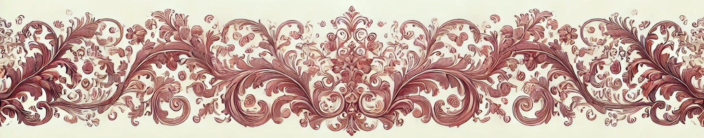

# Cover page

Hello! 👋  
My name is Kat Kmiotek  
I work as DevOps Engineer at Ivanti. I am a career changer, worked in hospitality for most of my life.  
This is my 3rd time as a speaker at Women Techmakers and I am happy you are here!  
I have a degree in Comparative Literature, but its not why I am speaking about writing documentation today.  
As you grow in your engineering career you define for yourself set of Engineering Principles. Let's say for me so far they are:
- enabling others
- my code changes should improve codebase health
- dislike to `if statement`
- fear of software entropy

### 🙀 Software entropy 🙀

Today we will learn how to fight with this monster

  
  

  
  
  
      

