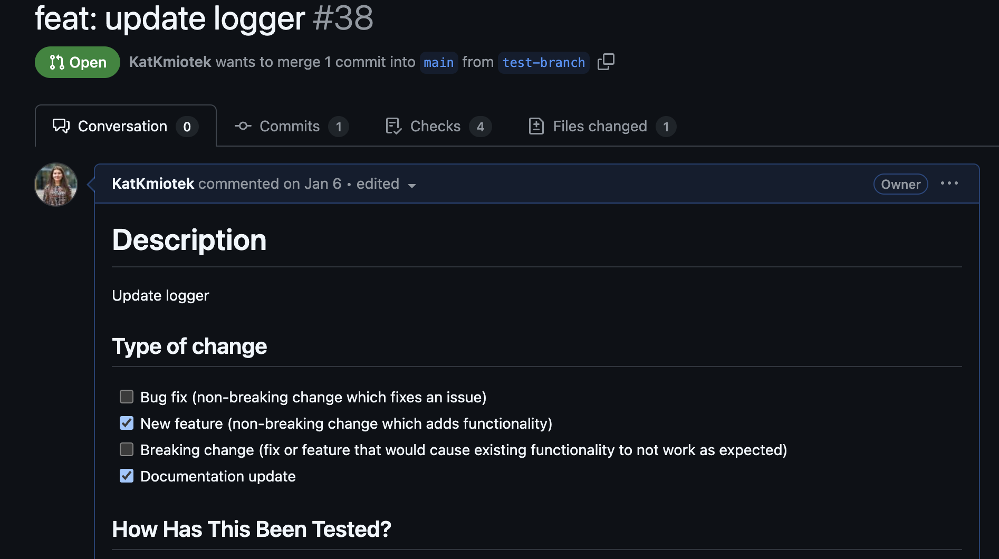

# Epilogue

### Once Story is published:
- update it along the code changes (PR template)
 

 
- as your colleague to try to follow and get feedback
- implement your organization or team template  
 
Writing README doesn't need to be boring task, there are frameworks and tools that make it fun.  
Writing clear documentation is part of engineering  
  
**Slow is smooth and smooth is fast** - we can have a good team velocity by making sure foundations (documentation) is there  
We should void being single source of failure by sharing your knowledge and decisions.  

  
    
  
Fight with software entropy! 💪

